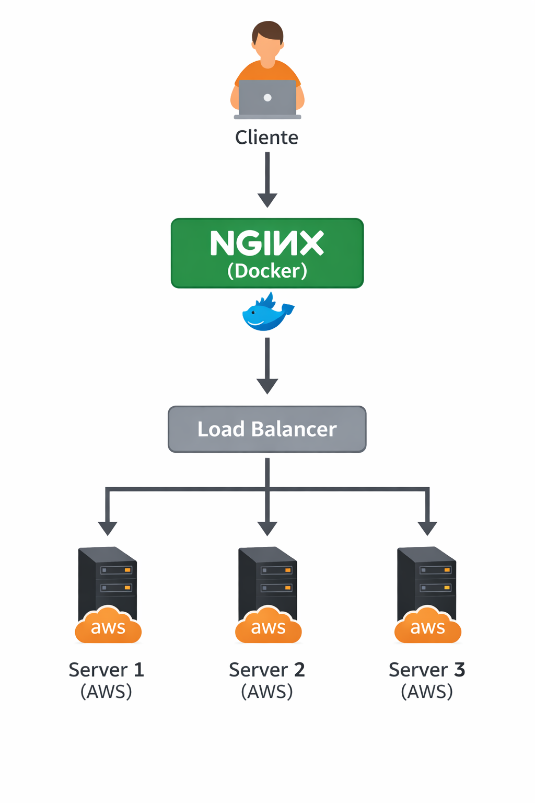

Docker: Utilização prática no cenário de Microsserviços
Denilson Bonatti, Instrutor - Digital Innovation One

Muito se tem falado de containers e consequentemente do Docker no ambiente de desenvolvimento. Mas qual a real função de um container no cenários de microsserviços? Qual a real função e quais exemplos práticos podem ser aplicados no dia a dia? Essas são algumas das questões que serão abordadas de forma prática pelo Expert Instructor Denilson Bonatti nesta Live Coding. IMPORTANTE: Agora nossas Live Codings acontecerão no canal oficial da dio._ no YouTube. Então, já corre lá e ative o lembrete! Pré-requisitos: Conhecimentos básicos em Linux, Docker e AWS.

# Microsserviços com Docker e Nginx

Projeto desenvolvido como parte do desafio da DIO para demonstrar a criação de uma arquitetura simples utilizando containers Docker e balanceamento de carga com Nginx.

## Tecnologias utilizadas

- Docker
- Nginx
- PHP
- Linux

## Arquitetura da aplicação

A aplicação utiliza um container Docker com Nginx configurado como proxy reverso e balanceador de carga, distribuindo requisições entre servidores de aplicação.

Fluxo da aplicação:

Cliente → Nginx → Servidores da aplicação

## Diagrama da arquitetura

## Estrutura do projeto
toshiro-shibakita
│
├── docs
│ └── arquitetura.png
├── banco.sql
├── dockerfile
├── index.php
├── nginx.conf
└── README.md
